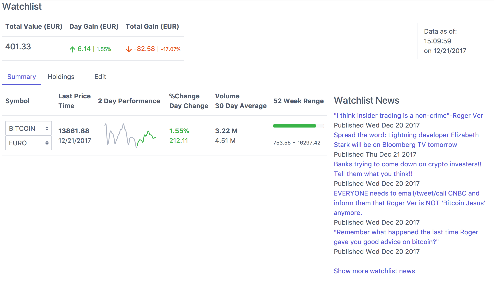

<p align="center">
  Bitcoin Watchlist
</p>

<p align="center">
  <a href="http://travis-ci.org/mycaule/portfolio"></a>
  <a href="https://david-dm.org/mycaule/portfolio"></a>
  <a href="https://david-dm.org/mycaule/portfolio?type=dev"></a>
  <br>
  <br>
</p>

A simple webapp to check the values of cryptocurrencies value compared to other time-series metrics.



The project uses [Coinbase API](https://coinbase.com) and [GDAX API](https://docs.gdax.com/#market-data).

[Open an issue](https://github.com/mycaule/portfolio/issues) if the data is incorrect or if you want some metric to appear on the list. You can also check [the roadmap for this application](#user-content-roadmap).

I hope you have lots of fun using it!

## Contributions

Changes and improvements are welcome! Feel free to fork and open a pull request into `master`.

#### Linting and Testing
```
npm install
npm test
```

#### Development
```
npm start
```

Bundles to a `dist/app.js` file that can run in a browser. The application runs without a server, just open `index.html` in your browser! Data is saved using *Local storage*

#### Production
```
parcel build app.js
git commit -am "Deploy on $(date +'%F %T %Z')"
git push
```

Regenerate the build and deploy to GitHub pages.

### Roadmap

- [ ] [Websocket feed](https://docs.gdax.com/#websocket-feed)
- [ ] Add stock exchange data for Benchmark [Google Finance](https://github.com/pilwon/node-google-finance), [Yahoo Finance](https://github.com/pilwon/node-yahoo-finance)
- [ ] Simulate trading strategies (like [exponential moving average](https://github.com/pirate/bitcoin-trader))
- [ ] Errors with `superstruct` [returning-errors](https://github.com/ianstormtaylor/superstruct/blob/master/examples/returning-errors.js), [throwing-errors](https://github.com/ianstormtaylor/superstruct/blob/master/examples/throwing-errors.js), [custom-errors](https://github.com/ianstormtaylor/superstruct/blob/master/examples/custom-errors.js)

### License

`portfolio` is licensed under the [MIT License](https://github.com/mycaule/portfolio/blob/master/LICENSE).

## References

* [Coinbase API Reference](https://developers.coinbase.com/api/v2#data-endpoints)
* [GDAX API](https://docs.gdax.com/#market-data)
* [Mavo](https://mavo.io/)
* [Baidu Echarts](https://github.com/ecomfe/echarts)
* [Bloomberg Watchlist](https://www.bloomberg.com/markets/watchlist)
* [rss2json](https://rss2json.com/google-feed-api-alternative)
* [CryptoCurrencies News Sites](https://www.reddit.com/r/CryptoCurrency/comments/6y8tbx/rss_feeds_cryptocurrencies_news_sites/)
